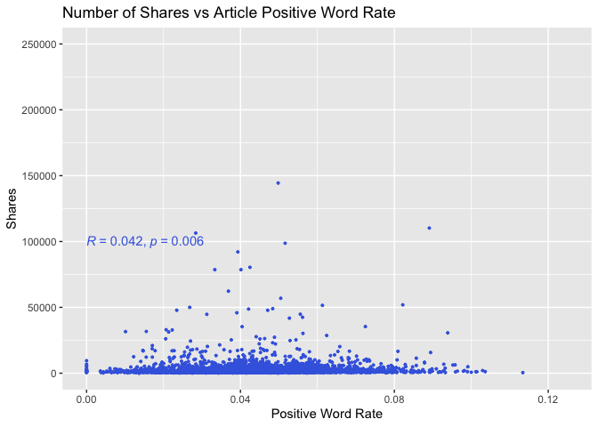

Business Analysis
================
Rachel Hencher and Yi Ren
2022-11-16

- <a href="#introduction" id="toc-introduction">Introduction</a>
- <a href="#load-packages" id="toc-load-packages">Load packages</a>
- <a href="#data" id="toc-data">Data</a>
  - <a href="#read-in-and-subset-data" id="toc-read-in-and-subset-data">Read
    in and subset data</a>
  - <a href="#automation" id="toc-automation">Automation</a>
  - <a href="#split-data-into-train-and-test"
    id="toc-split-data-into-train-and-test">Split data into train and
    test</a>
- <a href="#summarization" id="toc-summarization">Summarization</a>
  - <a href="#numeric-summaries" id="toc-numeric-summaries">Numeric
    summaries</a>
  - <a href="#pairs-plot" id="toc-pairs-plot">Pairs plot</a>
  - <a href="#barplot-for-weekday" id="toc-barplot-for-weekday">Barplot for
    weekday</a>
  - <a href="#boxplot-of-weekday-vs-shares"
    id="toc-boxplot-of-weekday-vs-shares">Boxplot of weekday vs shares</a>
  - <a href="#scatterplot-of-title-length--polarity-vs-shares"
    id="toc-scatterplot-of-title-length--polarity-vs-shares">Scatterplot of
    title length &amp; polarity vs shares</a>
  - <a href="#scatterplots-of-negative--positive-word-rate-vs-shares"
    id="toc-scatterplots-of-negative--positive-word-rate-vs-shares">Scatterplots
    of negative &amp; positive word rate vs shares</a>
- <a href="#modeling" id="toc-modeling">Modeling</a>
  - <a href="#set-up-cross-validation" id="toc-set-up-cross-validation">Set
    up cross validation</a>
  - <a href="#linear-regression-models"
    id="toc-linear-regression-models">Linear regression models</a>
    - <a href="#lasso-model" id="toc-lasso-model">LASSO model</a>
    - <a href="#forward-stepwise-model"
      id="toc-forward-stepwise-model">Forward stepwise model</a>
  - <a href="#ensemble-models" id="toc-ensemble-models">Ensemble models</a>
    - <a href="#random-forest-model" id="toc-random-forest-model">Random
      forest model</a>
    - <a href="#boosted-tree-model" id="toc-boosted-tree-model">Boosted tree
      model</a>
- <a href="#comparison" id="toc-comparison">Comparison</a>
  - <a href="#apply-model-for-prediction"
    id="toc-apply-model-for-prediction">Apply model for prediction</a>
  - <a href="#model-performance" id="toc-model-performance">Model
    performance</a>
    - <a href="#best-model-by-rmse-criteria"
      id="toc-best-model-by-rmse-criteria">Best model by RMSE criteria</a>
    - <a href="#best-model-by-rsquared-criteria"
      id="toc-best-model-by-rsquared-criteria">Best model by Rsquared
      criteria</a>

# Introduction

This report analyzes data on almost 40,000 articles published by
Mashable throughout the years 2013 and 2014. Although the original data
set includes information on 61 different features about the articles,
this report excludes some of those and condenses others so that we may
focus on the following 10 variables:

| Name                 | Definition                                                                       |
|:---------------------|:---------------------------------------------------------------------------------|
| Channel              | Data channel is Lifestyle, Entertainment, Business, Social Media, Tech, or World |
| Number_Title_Words   | Number of words in the title                                                     |
| Number_Content_Words | Number of words in the content                                                   |
| Number_Images        | Number of images                                                                 |
| Number_Videos        | Number of videos                                                                 |
| Positive_Word_Rate   | Rate of positive words in the content                                            |
| Negative_Word_Rate   | Rate of negative words in the content                                            |
| Title_Polarity       | Title polarity                                                                   |
| Weekday              | Weekday published                                                                |
| Shares               | Number of shares                                                                 |

The purpose of this report is to look for patterns and to make
predictions regarding the number of shares for articles in one of six
different channels. Following some exploratory data analysis, four
different models are used to model the response: a LASSO regression
model, a forward stepwise regression model, a random forest model, and a
boosted tree model.

# Load packages

``` r
library(readr)
library(dplyr)
library(knitr)
library(caret)
library(ggplot2)
library(GGally)
library(ggpubr)
```

# Data

## Read in and subset data

``` r
OnlineNewsPopularity <- read_csv("OnlineNewsPopularity.csv") 
OnlineNewsPopularity$url <- NULL

news <- OnlineNewsPopularity %>% 
  select("Number_Title_Words" = "n_tokens_title",
         "Number_Content_Words" = "n_tokens_content",
         "Number_Images" = "num_imgs",
         "Number_Videos" = "num_videos",
         starts_with("weekday_is"),
         starts_with("data_channel_is"),
         "Positive_Word_Rate" = "global_rate_positive_words",
         "Negative_Word_Rate" = "global_rate_negative_words",
         "Title_Polarity" = "title_sentiment_polarity",
         "Shares" = "shares")
  
news$Weekday <- as.factor(ifelse(news$weekday_is_monday == 1, "Monday",
                                 ifelse(news$weekday_is_tuesday == 1, "Tuesday", 
                                        ifelse(news$weekday_is_wednesday == 1, "Wednesday", 
                                               ifelse(news$weekday_is_thursday , "Thursday",
                                                      ifelse(news$weekday_is_friday == 1, "Friday",
                                                             ifelse(news$weekday_is_saturday == 1, "Saturday", "Sunday")))))))

news$Channel <- as.factor(ifelse(news$data_channel_is_lifestyle == 1, "Lifestyle",
                                 ifelse(news$data_channel_is_entertainment == 1, "Entertainment", 
                                        ifelse(news$data_channel_is_bus == 1, "Business", 
                                               ifelse(news$data_channel_is_socmed , "SocialMedia",
                                                      ifelse(news$data_channel_is_tech == 1, "Technology", "World"))))))
news_final <- news %>%
  select(-c(starts_with("weekday_is"), starts_with("data_channel_is")))
```

## Automation

The code below takes the `Channel` variable and filters our data set so
that we may solely explore the data for the designated channel.

``` r
news_data <- news_final %>% 
  filter(news_final$Channel == params$channel) %>% 
  select(-Channel)
```

## Split data into train and test

The `createDataPartition` function from the `caret` package allows us to
easily split our data into a training and test set with 70% of the data
designated to the training set. We will generate our models using the
training data and then make predictions using the testing data so that
we can have a measure of how well our model fits data not actually used
in the model.

``` r
set.seed(216)
intrain <- createDataPartition(news_data$Shares, p = 0.7, list = FALSE)

training <- news_data[intrain,]
testing <- news_data[-intrain,]
```

# Summarization

## Numeric summaries

The following table displays five-number summaries for each of the
numeric variables explored. This allows us to identify minimum, median,
and maximum values for each of our variables, as well as the lower and
upper quartiles. This can be useful information for understanding what
our data looks like and how to scale our plots.

``` r
stat <- training %>% 
  select(Number_Title_Words,
         Number_Content_Words,
         Number_Images,
         Number_Videos,
         Positive_Word_Rate,
         Negative_Word_Rate,
         Title_Polarity,
         Shares) %>% 
  apply(2, function(x){summary(x[!is.na(x)])}) 

kable(stat, caption = "Summary Stats for Numeric Variables", digits = 2)
```

|         | Number_Title_Words | Number_Content_Words | Number_Images | Number_Videos | Positive_Word_Rate | Negative_Word_Rate | Title_Polarity |    Shares |
|:--------|-------------------:|---------------------:|--------------:|--------------:|-------------------:|-------------------:|---------------:|----------:|
| Min.    |                3.0 |                 0.00 |          0.00 |          0.00 |               0.00 |               0.00 |          -1.00 |      1.00 |
| 1st Qu. |                9.0 |               245.00 |          1.00 |          0.00 |               0.03 |               0.01 |           0.00 |    952.25 |
| Median  |               10.0 |               397.00 |          1.00 |          0.00 |               0.04 |               0.01 |           0.00 |   1400.00 |
| Mean    |               10.3 |               535.09 |          1.82 |          0.65 |               0.04 |               0.01 |           0.08 |   3120.02 |
| 3rd Qu. |               12.0 |               719.75 |          1.00 |          0.00 |               0.05 |               0.02 |           0.14 |   2500.00 |
| Max.    |               19.0 |              4894.00 |         51.00 |         75.00 |               0.11 |               0.06 |           1.00 | 690400.00 |

Summary Stats for Numeric Variables

## Pairs plot

The following graphic displays the correlation between each of the
variables explored. There are several things to look out for… The
correlation between `Shares`, our response, and each of the other
variables, our predictors. A value close to -1 or 1 indicates the two
variables are highly correlated. A value close to 0 indicates little to
no correlation. Additionally, we should consider correlation between two
predictor variables as well. A high correlation between two predictor
variables is an indication of collinearity, which should be taken into
account when creating models later.

``` r
training_sub <- training %>% 
  select(-Weekday)

ggpairs(training_sub)
```

<!-- -->

## Barplot for weekday

The following barplot displays counts for how many articles in a
particular channel were published each day of the week over the time
frame covered by the data set. A higher value on this plot would
indicate that articles are published more often on that particular day.
It could be interesting to compare the number of articles published on
weekdays to weekends for a given channel.

``` r
ggplot(training, aes(x = Weekday)) +
  geom_bar(fill = "medium blue", position = "dodge") +
  labs(title = "Number of Articles Published for Each Day of the Week", y = "Count")
```

<!-- -->

## Boxplot of weekday vs shares

The following boxplots display a five-number summary of shares for each
day of the week. The axes are flipped, so if we wish to draw conclusions
regarding which day may be best to maximize the number of shares, we
would look for a boxplot with a median furthest to the right.

``` r
ggplot(training, aes(x = Weekday, y = Shares)) +
  geom_boxplot(color = "royal blue") +
  coord_flip() +
  scale_y_continuous(trans = "log10") +
  labs(title = "Number of Shares for Each Day of the Week")
```

<!-- -->

## Scatterplot of title length & polarity vs shares

The following scatterplot displays the number of shares for a given
article title length. The peak of the data, excluding outliers,
indicates the title length that maximizes the number of shares.
Additionally, the key displays the color coding for polarity of the
title so that we can look for patterns to see whether the polarity of
the title also has an effect on the number of shares.

``` r
ggplot(training, aes(x = Number_Title_Words, y = Shares)) + 
  geom_point(aes(color = Title_Polarity)) +
  labs(title = "Number of Shares vs Number of Words in the Article Title", x = "Number of Words in the Title")
```

<!-- -->

## Scatterplots of negative & positive word rate vs shares

The following two scatterplots compare the number of shares for a given
positive word rate and negative word rate. The two graphs have been
scaled the same so that they can be compared. If the data appears to
peak further to the right on the positive rate graph and further to the
left on the negative rate graph, we might conclude that having a higher
percentage of positive words will yield more shares. If the data appears
to peak further to the right on the negative rate graph and further to
the left on the positive rate graph, we might conclude that having a
higher percentage of negative words will yield more shares.
Additionally, each graph displays the correlation between shares and
positve or negative word rate. Again, a value of R closer to -1 or 1
would indicate the two variables are highly correlated and a value
closer to 0 would indicate little to no correlation.

``` r
ggplot(training, aes(x = Positive_Word_Rate, y = Shares)) + 
  geom_point(size = 0.7, color = "royal blue") + 
  stat_cor(method = "pearson", label.x = 0, label.y = 100000, color = "royal blue") +
  xlim(0, 0.125) + ylim(0, 250000) +
  labs(title = "Number of Shares vs Article Positive Word Rate", x = "Positive Word Rate")
```

<!-- -->

``` r
ggplot(training, aes(x = Negative_Word_Rate, y = Shares)) + 
  geom_point(size = 0.7, color = "dark blue") + 
  stat_cor(method = "pearson", label.x = 0, label.y = 100000, color = "dark blue") +
  xlim(0, 0.125) + ylim(0, 250000) +
  labs(title = "Number of Shares vs Article Negative Word Rate", x = "Negative Word Rate")
```

<!-- -->

# Modeling

Throughout this section of the report we utilize two supervised learning
methods, linear regression and tree models, in order to investigate our
response, `Shares`. In supervised learning, we often wish to make
inference on models or we may want to predict the response, which is
what we will be doing in these next two sections.

## Set up cross validation

The below sets up the cross-validation for our models. All models will
also utilize the `preProcess` argument in order to standardize the data.

``` r
control <- trainControl(method = "cv", number = 5)
```

## Linear regression models

Linear regression models make sense to explore in this scenario because
they describe relationships between predictor and response variables,
which is precisely what our goal is. In linear regression, we generate a
model where we fit betas, our intercept and slope(s), by minimizing the
sum of the squared residuals. However, in situations such as this where
there are many predictors, we do not typically include all predictors in
the model in order to prevent overfitting. Three of the most common
variable selection techniques for linear regression are: hypothesis
testing based methods (forward stepwise, backward stepwise, best subset
selection), penalization based methods (LASSO, Elastic Net, SCAD), and
removing variables based on collinearity. Below, we will generate our
models using the penalization based LASSO method and the hypothesis
testing forward stepwise selection method. It should be noted that these
methods do not include interactions, quadratics, etc.

### LASSO model

``` r
lasso_model <- train(Shares ~ .,
                     data = training,
                     method ='lasso',
                     preProcess = c("center", "scale"),
                     trControl = control)
predict(lasso_model$finalModel, type = "coef")
```

    ## $s
    ##  [1]  1  2  3  4  5  6  7  8  9 10 11 12 13 14 15 16
    ## 
    ## $fraction
    ##  [1] 0.00000000 0.06666667 0.13333333 0.20000000 0.26666667 0.33333333 0.40000000 0.46666667 0.53333333 0.60000000 0.66666667 0.73333333
    ## [13] 0.80000000 0.86666667 0.93333333 1.00000000
    ## 
    ## $mode
    ## [1] "step"
    ## 
    ## $coefficients
    ##    Number_Title_Words Number_Content_Words Number_Images Number_Videos Positive_Word_Rate Negative_Word_Rate Title_Polarity WeekdayMonday
    ## 0             0.00000              0.00000      0.000000        0.0000           0.000000             0.0000        0.00000       0.00000
    ## 1             0.00000              0.00000      0.000000      387.9822           0.000000             0.0000        0.00000       0.00000
    ## 2             0.00000              0.00000      0.000000      409.8800           0.000000             0.0000        0.00000      21.89784
    ## 3             0.00000              0.00000      0.000000      632.0283           0.000000           226.7260        0.00000     249.71789
    ## 4             0.00000              0.00000      0.000000      726.1728           0.000000           318.1634        0.00000     355.40503
    ## 5            33.92928              0.00000      0.000000      758.8212           0.000000           350.2376        0.00000     394.15569
    ## 6            39.21171              0.00000      5.552683      763.8985           0.000000           355.1906        0.00000     400.07247
    ## 7            42.59554              0.00000      9.021824      767.1708           0.000000           358.2767        0.00000     404.35968
    ## 8            89.19633              0.00000     55.812700      811.5036           0.000000           400.2355        0.00000     456.87901
    ## 9           132.55068              0.00000     97.964742      852.0951           0.000000           438.8161        0.00000     532.34250
    ## 10          136.59762              0.00000    101.936656      855.5340           3.339763           442.4854        0.00000     539.29198
    ## 11          168.18682              0.00000    131.027773      881.8785          33.376564           466.1981      -36.75636     590.73550
    ## 12          183.01596            -31.50782    152.177643      898.0972          52.444905           480.0839      -53.90003     615.88278
    ## 13          186.50299            -38.62089    156.986007      902.0127          56.483988           483.3037      -57.73558     629.78668
    ## 14          210.20609            -86.76419    188.741824      927.4245          84.023681           504.5589      -84.05560     688.85192
    ## 15          225.42578           -118.01800    210.657655      945.7183         101.568821           519.2430     -100.54848     784.98397
    ##    WeekdaySaturday WeekdaySunday WeekdayThursday WeekdayTuesday WeekdayWednesday
    ## 0           0.0000      0.000000         0.00000        0.00000         0.000000
    ## 1           0.0000      0.000000         0.00000        0.00000         0.000000
    ## 2           0.0000      0.000000         0.00000        0.00000         0.000000
    ## 3           0.0000      0.000000         0.00000        0.00000         0.000000
    ## 4         105.6369      0.000000         0.00000        0.00000         0.000000
    ## 5         144.6571      0.000000         0.00000        0.00000         0.000000
    ## 6         150.5393      0.000000         0.00000        0.00000         0.000000
    ## 7         154.5583      4.105292         0.00000        0.00000         0.000000
    ## 8         206.4173     56.490815         0.00000        0.00000       -22.657843
    ## 9         267.7628    121.213581         0.00000       76.32046       -15.751944
    ## 10        273.2862    126.970170         0.00000       83.48471       -15.063997
    ## 11        313.2238    170.200669         0.00000      136.34272       -10.548741
    ## 12        334.9433    194.626731         0.00000      160.15916        -8.761266
    ## 13        344.0090    205.182321        14.04234      173.92006         0.000000
    ## 14        387.6987    255.228889        72.42110      231.31171         0.000000
    ## 15        445.2015    323.005343       170.78494      327.52117        97.794512

``` r
lasso_model$bestTune
```

    ##   fraction
    ## 1      0.1

### Forward stepwise model

``` r
fwdstep_model <- train(Shares ~ .,
                       data = training,
                       method ='glmStepAIC',
                       preProcess = c("center", "scale"),
                       trControl = control,
                       direction = "forward",
                       trace = FALSE)
fwdstep_model
```

    ## Generalized Linear Model with Stepwise Feature Selection 
    ## 
    ## 4382 samples
    ##    8 predictor
    ## 
    ## Pre-processing: centered (13), scaled (13) 
    ## Resampling: Cross-Validated (5 fold) 
    ## Summary of sample sizes: 3505, 3506, 3506, 3505, 3506 
    ## Resampling results:
    ## 
    ##   RMSE      Rsquared     MAE     
    ##   14413.34  0.006930718  2864.648

## Ensemble models

Ensemble modeling is a process where multiple diverse models are created
to predict an outcome, either by using different modeling algorithms or
using different training data sets. Each weak learner is fitted on the
training set and provides predictions obtained. The final prediction
result is computed by combining the results from all the weak learners.
Thus, ensemble learning techniques have been proven to yield better
performance on machine learning problems.

### Random forest model

While the previously mentioned models can both be used for
interpretation and prediction, random forest models can only be used for
prediction. Like a bagged tree model, we first create bootstrap sample,
then train tree on this sample, repeat, and either average or use
majority vote for final prediction depending on whether our predictors
are continuous or categorical respectively. However, random forest
models extends the idea of bagging and is usually better, but instead of
including every predictor in each one of our trees, we only include a
random subset of predictors. In the random forest model below, we
include *p/3* predictors since out data is continuous.

``` r
rf_model <- train(Shares ~ ., 
                  data = training, 
                  method = "rf", 
                  preProcess = c("center", "scale"), 
                  trControl = control, 
                  tuneGrid = expand.grid(mtry = 1:((ncol(training) - 1)/3)))
rf_model
```

    ## Random Forest 
    ## 
    ## 4382 samples
    ##    8 predictor
    ## 
    ## Pre-processing: centered (13), scaled (13) 
    ## Resampling: Cross-Validated (5 fold) 
    ## Summary of sample sizes: 3506, 3506, 3506, 3505, 3505 
    ## Resampling results across tuning parameters:
    ## 
    ##   mtry  RMSE      Rsquared    MAE     
    ##   1     14337.31  0.01673479  2795.908
    ##   2     14631.00  0.01290402  2868.021
    ## 
    ## RMSE was used to select the optimal model using the smallest value.
    ## The final value used for the model was mtry = 1.

### Boosted tree model

Similarly to the random forest model above, a boosted tree model can
look at variable importance measures and make predictions, but loses
interpretability. A boosted tree model involves the slow training of
trees. We begin by initializing predictions as 0, then find the
residuals, fit a tree with *d* splits, update the predictors, and
finally update the residuals and repeat.

``` r
gbm_model <- train(Shares ~ .,
                   data = training,
                   method = "gbm",
                   trControl = control,
                   preProcess = c("center", "scale"),
                   verbose = FALSE)
gbm_model$bestTune
```

    ##   n.trees interaction.depth shrinkage n.minobsinnode
    ## 1      50                 1       0.1             10

``` r
plot(gbm_model)
```

<!-- -->

As the output suggested, we can use the best tuning information to
predict our interest. Shrinkage parameter lambda controls the rate at
which boosting learns. The number of splits in each tree controls the
complexity of the boosted ensemble (controlled with max. depth). We can
also visualize the relationship between number of iterations and RMSE
under the cross validation.

# Comparison

## Apply model for prediction

We make our predictions on the data not used to generate the model, the
testing data, so that we may reduce bias.

``` r
lasso_predict <- predict(lasso_model, newdata = testing)
fwdstep_predict <- predict(fwdstep_model, newdata = testing)
rf_predict <- predict(rf_model, newdata = testing)
gbm_predict <- predict(gbm_model, newdata = testing)
```

## Model performance

We use the `postResample` function in order to find common metrics which
we can use to compare models. The aim is to minimize RMSE and maximize
Rsquared.

``` r
a <- postResample(lasso_predict, obs = testing$Shares)
b <- postResample(fwdstep_predict, obs = testing$Shares)
c <- postResample(rf_predict, obs = testing$Shares)
d <- postResample(gbm_predict, obs = testing$Shares)

table <- as_tibble(rbind(a, b, c, d))
Model <- c("Lasso", "Forward_Stepwise", "Random_Forest", "Boosted_Tree")
performance_table <- cbind(Model, table)
performance_table
```

    ##              Model     RMSE     Rsquared      MAE
    ## 1            Lasso 10068.70 0.0003798429 2656.104
    ## 2 Forward_Stepwise 10110.00 0.0005097813 2717.107
    ## 3    Random_Forest 10060.12 0.0056711150 2645.669
    ## 4     Boosted_Tree 10128.78 0.0038489997 2730.695

### Best model by RMSE criteria

``` r
performance_table %>% slice_min(RMSE)
```

    ##           Model     RMSE    Rsquared      MAE
    ## 1 Random_Forest 10060.12 0.005671115 2645.669

### Best model by Rsquared criteria

``` r
performance_table %>% slice_max(Rsquared)
```

    ##           Model     RMSE    Rsquared      MAE
    ## 1 Random_Forest 10060.12 0.005671115 2645.669
