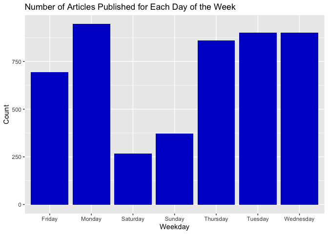
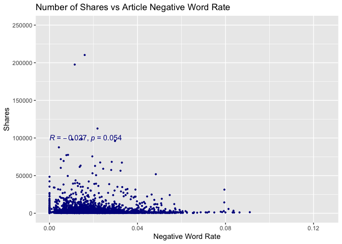

Entertainment Analysis
================
Rachel Hencher and Yi Ren
2022-11-13

-   [Introduction](#introduction)
-   [Load packages](#load-packages)
-   [Data](#data)
    -   [Read in and subset data](#read-in-and-subset-data)
    -   [Automation](#automation)
    -   [Split data into train and
        test](#split-data-into-train-and-test)
-   [Summarization](#summarization)
    -   [Numeric summaries](#numeric-summaries)
    -   [Pairs plot](#pairs-plot)
    -   [Barplot for weekday](#barplot-for-weekday)
    -   [Boxplot of weekday vs shares](#boxplot-of-weekday-vs-shares)
    -   [Scatterplot of title length & polarity vs
        shares](#scatterplot-of-title-length--polarity-vs-shares)
    -   [Scatterplots of negative & positive word rate vs
        shares](#scatterplots-of-negative--positive-word-rate-vs-shares)
-   [Modeling](#modeling)
    -   [Set up cross validation](#set-up-cross-validation)
    -   [Linear regression models](#linear-regression-models)
        -   [LASSO model](#lasso-model)
        -   [Forward stepwise model](#forward-stepwise-model)
    -   [Ensemble models](#ensemble-models)
        -   [Random forest model](#random-forest-model)
        -   [Boosted tree model](#boosted-tree-model)
-   [Comparison](#comparison)
    -   [Apply model for prediction](#apply-model-for-prediction)
    -   [Model performance](#model-performance)
        -   [Best model by RMSE criteria](#best-model-by-rmse-criteria)
        -   [Best model by Rsquared
            criteria](#best-model-by-rsquared-criteria)

# Introduction

This report analyzes data on almost 40,000 articles published by
Mashable throughout the years 2013 and 2014. Although the original data
set includes information on 61 different features about the articles,
this report excludes some of those and condenses others so that we may
focus on the following 10 variables:

| Name                 | Definition                                                                       |
|:---------------------|:---------------------------------------------------------------------------------|
| Channel              | Data channel is Lifestyle, Entertainment, Business, Social Media, Tech, or World |
| Number_Title_Words   | Number of words in the title                                                     |
| Number_Content_Words | Number of words in the content                                                   |
| Number_Images        | Number of images                                                                 |
| Number_Videos        | Number of videos                                                                 |
| Positive_Word_Rate   | Rate of positive words in the content                                            |
| Negative_Word_Rate   | Rate of negative words in the content                                            |
| Title_Polarity       | Title polarity                                                                   |
| Weekday              | Weekday published                                                                |
| Shares               | Number of shares                                                                 |

The purpose of this report is to look for patterns and to make
predictions regarding the number of shares for articles in one of six
different channels. Following some exploratory data analysis, four
different models are used to model the response: a LASSO regression
model, a forward stepwise regression model, a random forest model, and a
boosted tree model.

# Load packages

``` r
library(readr)
library(dplyr)
library(knitr)
library(caret)
library(ggplot2)
library(GGally)
library(ggpubr)
```

# Data

## Read in and subset data

``` r
OnlineNewsPopularity <- read_csv("OnlineNewsPopularity.csv") 
OnlineNewsPopularity$url <- NULL

news <- OnlineNewsPopularity %>% 
  select("Number_Title_Words" = "n_tokens_title",
         "Number_Content_Words" = "n_tokens_content",
         "Number_Images" = "num_imgs",
         "Number_Videos" = "num_videos",
         starts_with("weekday_is"),
         starts_with("data_channel_is"),
         "Positive_Word_Rate" = "global_rate_positive_words",
         "Negative_Word_Rate" = "global_rate_negative_words",
         "Title_Polarity" = "title_sentiment_polarity",
         "Shares" = "shares")
  
news$Weekday <- as.factor(ifelse(news$weekday_is_monday == 1, "Monday",
                                 ifelse(news$weekday_is_tuesday == 1, "Tuesday", 
                                        ifelse(news$weekday_is_wednesday == 1, "Wednesday", 
                                               ifelse(news$weekday_is_thursday , "Thursday",
                                                      ifelse(news$weekday_is_friday == 1, "Friday",
                                                             ifelse(news$weekday_is_saturday == 1, "Saturday", "Sunday")))))))

news$Channel <- as.factor(ifelse(news$data_channel_is_lifestyle == 1, "Lifestyle",
                                 ifelse(news$data_channel_is_entertainment == 1, "Entertainment", 
                                        ifelse(news$data_channel_is_bus == 1, "Bus", 
                                               ifelse(news$data_channel_is_socmed , "Socmed",
                                                      ifelse(news$data_channel_is_tech == 1, "Tech", "World"))))))
news_final <- news %>%
  select(-c(starts_with("weekday_is"), starts_with("data_channel_is")))
```

## Automation

``` r
news_data <- news_final %>% 
  filter(news_final$Channel == params$channel) %>% 
  select(-Channel)
```

## Split data into train and test

The `createDataPartition` function from the `caret` package allows us to
easily split our data into a training and test set with 70% of the data
designated to the training set. We will generate our models using the
training data and then make predictions using the testing data so that
we can have a measure of how well our model fits data not actually used
in the model.

``` r
set.seed(216)
intrain <- createDataPartition(news_data$Shares, p = 0.7, list = FALSE)

training <- news_data[intrain,]
testing <- news_data[-intrain,]
```

# Summarization

## Numeric summaries

The following table displays five-number summaries for each of the
numeric variables explored.

``` r
stat <- training %>% 
  select(Number_Title_Words,
         Number_Content_Words,
         Number_Images,
         Number_Videos,
         Positive_Word_Rate,
         Negative_Word_Rate,
         Title_Polarity,
         Shares) %>% 
  apply(2, function(x){summary(x[!is.na(x)])}) 

kable(stat, caption = "Summary Stats for Numeric Variables", digits = 2)
```

|         | Number_Title_Words | Number_Content_Words | Number_Images | Number_Videos | Positive_Word_Rate | Negative_Word_Rate | Title_Polarity |   Shares |
|:--------|-------------------:|---------------------:|--------------:|--------------:|-------------------:|-------------------:|---------------:|---------:|
| Min.    |               3.00 |                  0.0 |          0.00 |          0.00 |               0.00 |               0.00 |          -1.00 |     47.0 |
| 1st Qu. |              10.00 |                256.0 |          1.00 |          0.00 |               0.03 |               0.01 |           0.00 |    833.0 |
| Median  |              11.00 |                435.0 |          1.00 |          1.00 |               0.04 |               0.02 |           0.00 |   1200.0 |
| Mean    |              11.01 |                608.7 |          6.35 |          2.61 |               0.04 |               0.02 |           0.07 |   2997.2 |
| 3rd Qu. |              12.00 |                814.0 |          8.00 |          1.00 |               0.05 |               0.02 |           0.17 |   2100.0 |
| Max.    |              18.00 |               6505.0 |        128.00 |         74.00 |               0.15 |               0.09 |           1.00 | 210300.0 |

Summary Stats for Numeric Variables

## Pairs plot

The following graphic displays the correlation between each of the
variables explored. There are several things to look out for… The
correlation between `Shares`, our response, and each of the other
variables, our predictors. A value close to -1 or 1 indicates the two
variables are highly correlated. A value close to 0 indicates little to
no correlation. Additionally, we should consider correlation between two
predictor variables as well. A high correlation between two predictor
variables is an indication of collinearity, which should be taken into
account when creating models later.

``` r
training_sub <- training %>% 
  select(-Weekday)

ggpairs(training_sub)
```

<!-- -->

## Barplot for weekday

The following barplot displays counts for how many articles in a
particular channel were published each day of the week over the time
frame covered by the data set.

``` r
ggplot(training, aes(x = Weekday)) +
  geom_bar(fill = "medium blue", position = "dodge") +
  labs(y = "Count")
```

<!-- -->

## Boxplot of weekday vs shares

The following boxplots display a five-number summary of shares for each
day of the week. The axes are flipped, so if we wish to draw conclusions
regarding which day may be best to maximize shares, we would look for a
boxplot with a median furthest to the right.

``` r
ggplot(training, aes(x = Weekday, y = Shares)) +
  geom_boxplot(color = "royal blue") +
  coord_flip() +
  scale_y_continuous(trans = "log10")
```

<!-- -->

## Scatterplot of title length & polarity vs shares

The following scatterplot displays the number of shares for a given
title length. The peak of the data, excluding outliers, indicates the
title length that maximizes the number of shares. Additionally, the key
displays the color coding for polarity of the title so that we can look
for patterns to see whether the polarity of the title also has an effect
on the number of shares.

``` r
ggplot(training, aes(x = Number_Title_Words, y = Shares)) + 
  geom_point(aes(color = Title_Polarity))
```

<!-- -->

## Scatterplots of negative & positive word rate vs shares

The following two scatterplots compare the number of shares for a given
positive word rate and negative word rate. The two graphs have been
scaled the same so that they can be compared. If the data appears to
peak further to the right on the positive rate graph and further to the
left on the negative rate graph, we might conclude that having a higher
percentage of positive words will yield more shares. If the data appears
to peak further to the right on the negative rate graph and further to
the left on the positive rate graph, we might conclude that having a
higher percentage of negative words will yield more shares.
Additionally, each graph displays the correlation between shares and
positve or negative word rate. Again, a value of R closer to -1 or 1
would indicate the two variables are highly correlated and a value
closer to 0 would indicate little to no correlation.

``` r
ggplot(training, aes(x = Positive_Word_Rate, y = Shares)) + 
  geom_point(size = 0.7, color = "royal blue") + 
  stat_cor(method = "pearson", label.x = 0, label.y = 100000, color = "royal blue") +
  xlim(0, 0.125) + ylim(0, 250000)
```

    ## Warning: Removed 1 rows containing non-finite values
    ## (stat_cor).

    ## Warning: Removed 1 rows containing missing values
    ## (geom_point).

<!-- -->

``` r
ggplot(training, aes(x = Negative_Word_Rate, y = Shares)) + 
  geom_point(size = 0.7, color = "dark blue") + 
  stat_cor(method = "pearson", label.x = 0, label.y = 100000, color = "dark blue") +
  xlim(0, 0.125) + ylim(0, 250000)
```

<!-- -->

# Modeling

Throughout this section of the report we utilize two supervised learning
methods, linear regression and tree models, in order to investigate our
response, `Shares`. In supervised learning, we often wish to make
inference on the model or may want to predict the response, which is
what we will be doing in the next and final section.

## Set up cross validation

The below sets up the cross-validation for our models. All models will
also utilize the `preProcess` argument in order to standardize the data.

``` r
control <- trainControl(method = "cv", number = 5)
```

## Linear regression models

In linear regression, we generate a model where we fit betas by
minimizing the sum of the squared residuals. Three of the most common
variable selection techniques for linear regression are: hypothesis
testing based methods (forward stepwise, backward stepwise, best subset
selection), penalization based methods (LASSO, Elastic Net, SCAD), and
removing variables based on collinearity. Below, we will generate our
models using the penalization based LASSO method and the hypothesis
testing forward stepwise selection method. It should be noted that these
methods do not include interactions, quadratics, etc.

### LASSO model

``` r
lasso_model <- train(Shares ~ .,
                     data = training,
                     method ='lasso',
                     preProcess = c("center", "scale"),
                     trControl = control)
predict(lasso_model$finalModel, type = "coef")
```

    ## $s
    ##  [1]  1  2  3  4  5  6  7  8  9 10 11 12 13 14
    ## 
    ## $fraction
    ##  [1] 0.00000000 0.07692308 0.15384615
    ##  [4] 0.23076923 0.30769231 0.38461538
    ##  [7] 0.46153846 0.53846154 0.61538462
    ## [10] 0.69230769 0.76923077 0.84615385
    ## [13] 0.92307692 1.00000000
    ## 
    ## $mode
    ## [1] "step"
    ## 
    ## $coefficients
    ##    Number_Title_Words Number_Content_Words
    ## 0             0.00000              0.00000
    ## 1             0.00000              0.00000
    ## 2             0.00000              0.00000
    ## 3             0.00000              0.00000
    ## 4             0.00000             15.86360
    ## 5             0.00000             79.81106
    ## 6             0.00000            108.59819
    ## 7             0.00000            141.97612
    ## 8             0.00000            142.95825
    ## 9             0.00000            148.20399
    ## 10            0.00000            162.86536
    ## 11            0.00000            178.23269
    ## 12           18.71053            198.82748
    ## 13           25.40909            207.92750
    ##    Number_Images Number_Videos
    ## 0        0.00000       0.00000
    ## 1        0.00000       0.00000
    ## 2       85.16547       0.00000
    ## 3       89.44129       0.00000
    ## 4       97.67031       0.00000
    ## 5      130.71976       0.00000
    ## 6      145.40632       0.00000
    ## 7      152.92070       0.00000
    ## 8      153.17295       0.00000
    ## 9      154.26401       0.00000
    ## 10     157.64931       0.00000
    ## 11     161.29816       0.00000
    ## 12     166.73092       0.00000
    ## 13     166.71462      -7.62048
    ##    Positive_Word_Rate Negative_Word_Rate
    ## 0             0.00000           0.000000
    ## 1             0.00000           0.000000
    ## 2             0.00000           0.000000
    ## 3             0.00000          -4.466122
    ## 4             0.00000         -23.616722
    ## 5             0.00000        -103.700092
    ## 6             0.00000        -140.780001
    ## 7           -25.64967        -172.899283
    ## 8           -26.37898        -173.868041
    ## 9           -30.92628        -178.152945
    ## 10          -43.86503        -190.276170
    ## 11          -57.00402        -203.005627
    ## 12          -74.11631        -221.087720
    ## 13          -79.84211        -225.451823
    ##    Title_Polarity WeekdayMonday
    ## 0        0.000000      0.000000
    ## 1        0.000000      0.000000
    ## 2        0.000000      0.000000
    ## 3        0.000000      0.000000
    ## 4        0.000000      0.000000
    ## 5        0.000000      0.000000
    ## 6        0.000000      0.000000
    ## 7        0.000000      0.000000
    ## 8        0.000000      1.092858
    ## 9        4.446634      6.970312
    ## 10      17.020988     20.193395
    ## 11      30.472187     21.368381
    ## 12      49.193487     23.136672
    ## 13      55.896134     23.866858
    ##    WeekdaySaturday WeekdaySunday
    ## 0          0.00000       0.00000
    ## 1          0.00000      11.74391
    ## 2          0.00000      96.90938
    ## 3          0.00000     101.19092
    ## 4          0.00000     116.77368
    ## 5          0.00000     172.84192
    ## 6         29.39353     201.32381
    ## 7         57.89660     227.96344
    ## 8         58.91280     228.95393
    ## 9         64.33239     234.21709
    ## 10        77.72587     246.82679
    ## 11        84.45992     251.54978
    ## 12        94.23911     258.18941
    ## 13        97.59338     260.42331
    ##    WeekdayThursday WeekdayTuesday
    ## 0          0.00000       0.000000
    ## 1          0.00000       0.000000
    ## 2          0.00000       0.000000
    ## 3          0.00000       0.000000
    ## 4          0.00000       0.000000
    ## 5          0.00000       0.000000
    ## 6          0.00000       0.000000
    ## 7          0.00000       0.000000
    ## 8          0.00000       0.000000
    ## 9          0.00000       0.000000
    ## 10         0.00000      -9.256001
    ## 11       -22.11431     -31.417878
    ## 12       -53.11183     -62.708990
    ## 13       -63.32527     -72.949193
    ##    WeekdayWednesday
    ## 0           0.00000
    ## 1           0.00000
    ## 2           0.00000
    ## 3           0.00000
    ## 4           0.00000
    ## 5         -59.32812
    ## 6         -83.16444
    ## 7        -105.60654
    ## 8        -105.97196
    ## 9        -107.89180
    ## 10       -116.74075
    ## 11       -138.48176
    ## 12       -169.07138
    ## 13       -179.05225

``` r
lasso_model$bestTune
```

    ##   fraction
    ## 1      0.1

### Forward stepwise model

``` r
fwdstep_model <- train(Shares ~ .,
                       data = training,
                       method ='glmStepAIC',
                       preProcess = c("center", "scale"),
                       trControl = control,
                       direction = "forward",
                       trace = FALSE)
fwdstep_model
```

    ## Generalized Linear Model with Stepwise Feature Selection 
    ## 
    ## 4941 samples
    ##    8 predictor
    ## 
    ## Pre-processing: centered (13), scaled (13) 
    ## Resampling: Cross-Validated (5 fold) 
    ## Summary of sample sizes: 3952, 3954, 3952, 3953, 3953 
    ## Resampling results:
    ## 
    ##   RMSE      Rsquared     MAE     
    ##   7602.937  0.001154724  2982.266

## Ensemble models

Ensemble modeling is a process where multiple diverse models are created
to predict an outcome, either by using different modeling algorithms or
using different training data sets. Each weak learner is fitted on the
training set and provides predictions obtained. The final prediction
result is computed by combining the results from all the weak learners.
Thus, ensemble learning techniques have been proven to yield better
performance on machine learning problems.

### Random forest model

While the previously mentioned models can both be used for
interpretation and prediction, random forest models can only be used for
prediction. Like a bagged tree model, we first create bootstrap sample,
then train tree on this sample, repeat, and either average or use
majority vote for final prediction depending on whether our predictors
are continuous or categorical respectively. However, random forest
models extends the idea of bagging and is usually better, but instead of
including every predictor in each one of our trees, we only include a
random subset of predictors. In the random forest model below, we
include *p/3* predictors since out data is continuous.

``` r
rf_model <- train(Shares ~ ., 
                  data = training, 
                  method = "rf", 
                  preProcess = c("center", "scale"), 
                  trControl = control, 
                  tuneGrid = expand.grid(mtry = 1:((ncol(training) - 1)/3)))
rf_model
```

    ## Random Forest 
    ## 
    ## 4941 samples
    ##    8 predictor
    ## 
    ## Pre-processing: centered (13), scaled (13) 
    ## Resampling: Cross-Validated (5 fold) 
    ## Summary of sample sizes: 3953, 3954, 3952, 3954, 3951 
    ## Resampling results across tuning parameters:
    ## 
    ##   mtry  RMSE      Rsquared     MAE     
    ##   1     7437.066  0.003327966  2963.469
    ##   2     7486.654  0.005395750  3022.140
    ## 
    ## RMSE was used to select the optimal
    ##  model using the smallest value.
    ## The final value used for the model was mtry
    ##  = 1.

### Boosted tree model

Similarly to the random forest model above, a boosted tree model can
look at variable importance measures and make predictions, but loses
interpretability. A boosted tree model involves the slow training of
trees. We begin by initializing predictions as 0, then find the
residuals, fit a tree with *d* splits, update the predictors, and
finally update the residuals and repeat.

``` r
gbm_model <- train(Shares ~ .,
                   data = training,
                   method = "gbm",
                   trControl = control,
                   preProcess = c("center", "scale"),
                   verbose = FALSE)
gbm_model$bestTune
```

    ##   n.trees interaction.depth shrinkage
    ## 2     100                 1       0.1
    ##   n.minobsinnode
    ## 2             10

``` r
plot(gbm_model)
```

<!-- -->

As the output suggested, we can use the best tuning information to
predict our interest. Shrinkage parameter lambda controls the rate at
which boosting learns. The number of splits in each tree, which controls
the complexity of the boosted ensemble (controlled with max.depth). We
can also visual the relationship between number of iterations and RMSE
under the cross validation.

# Comparison

## Apply model for prediction

We make our predictions on the data not used to generate the model, the
testing data, so that we may reduce bias.

``` r
lasso_predict <- predict(lasso_model, newdata = testing)
fwdstep_predict <- predict(fwdstep_model, newdata = testing)
rf_predict <- predict(rf_model, newdata = testing)
gbm_predict <- predict(gbm_model, newdata = testing)
```

## Model performance

We use the `postResample` function in order to find common metrics which
we can use to compare models. The aim is to minimize RMSE and maximize
Rsquared.

``` r
a <- postResample(lasso_predict, obs = testing$Shares)
b <- postResample(fwdstep_predict, obs = testing$Shares)
c <- postResample(rf_predict, obs = testing$Shares)
d <- postResample(gbm_predict, obs = testing$Shares)

table <- as_tibble(rbind(a, b, c, d))
Model <- c("Lasso", "Forward_Stepwise", "Random_Forest", "Boosted_Tree")
performance_table <- cbind(Model, table)
performance_table
```

    ##              Model     RMSE     Rsquared
    ## 1            Lasso 8130.569 0.0008775853
    ## 2 Forward_Stepwise 8158.273 0.0002095061
    ## 3    Random_Forest 8113.286 0.0051437850
    ## 4     Boosted_Tree 8179.623 0.0006818745
    ##        MAE
    ## 1 2910.586
    ## 2 2922.267
    ## 3 2907.718
    ## 4 2981.373

### Best model by RMSE criteria

``` r
performance_table %>% slice_min(RMSE)
```

    ##           Model     RMSE    Rsquared      MAE
    ## 1 Random_Forest 8113.286 0.005143785 2907.718

### Best model by Rsquared criteria

``` r
performance_table %>% slice_max(Rsquared)
```

    ##           Model     RMSE    Rsquared      MAE
    ## 1 Random_Forest 8113.286 0.005143785 2907.718
