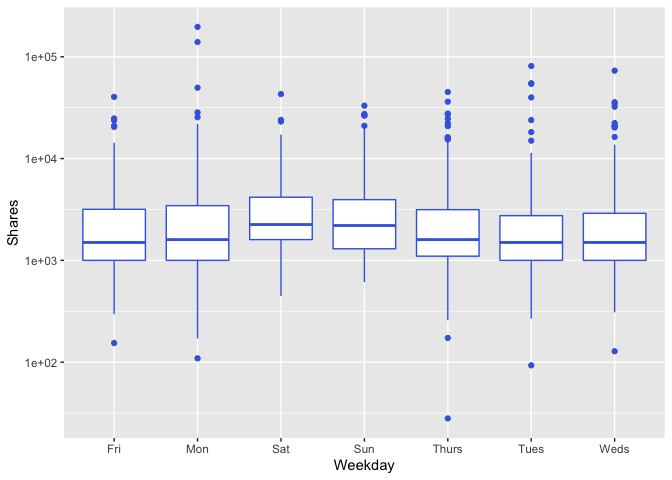
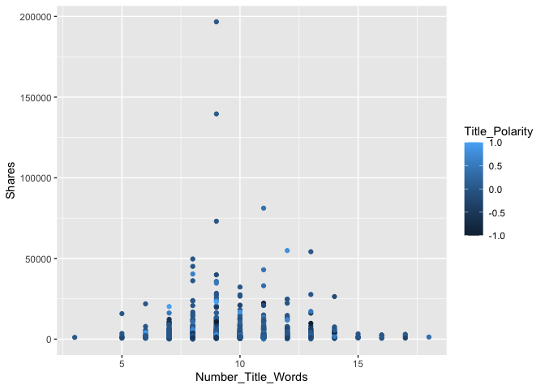

ST 558 Project 3
================
Rachel Hencher and Yi Ren
2022-11-02

# Load packages

``` r
library(readr)
library(dplyr)
library(caret)
library(ggplot2)
```

# Data

## Read in and subset data

``` r
OnlineNewsPopularity <- read_csv("OnlineNewsPopularity.csv") 
OnlineNewsPopularity$url <- NULL
channel <- function(x){
  base <- "data_channel_is_"
  data <- paste0(base,x) %>%  
          noquote()
  news <- OnlineNewsPopularity %>% 
          filter(get(data) == 1) %>% 
          select("Number_Title_Words" = "n_tokens_title",
                 "Number_Content_Words" = "n_tokens_content",
                 "Number_Images" = "num_imgs",
                 "Number_Videos" = "num_videos",
                 starts_with("weekday_is"),
                 "Positive_Word_Rate" = "global_rate_positive_words",
                 "Negative_Word_Rate" = "global_rate_negative_words",
                 "Title_Polarity" = "title_sentiment_polarity",
                 "Shares" = "shares")
  
news$Weekday <- as.factor(ifelse(news$weekday_is_monday == 1, "Mon",
                                 ifelse(news$weekday_is_tuesday == 1, "Tues", 
                                        ifelse(news$weekday_is_wednesday == 1, "Weds", 
                                               ifelse(news$weekday_is_thursday , "Thurs",
                                                      ifelse(news$weekday_is_friday == 1, "Fri",
                                                             ifelse(news$weekday_is_saturday == 1, "Sat", "Sun")))))))
news_final <- news %>%
  select(-starts_with("weekday_is"))
return(news_final)
}
```

## Choose an option for the `channel` function argument:

- *lifestyle*: Is the desired data channel lifestyle?  
- *entertainment*: Is the desired data channel entertainment?  
- *bus*: Is the desired data channel business?  
- *socmed*: Is the desired data channel social media?
- *tech*: Is the desired data channel technology?  
- *world*: Is the desired data channel world?

``` r
news_data <- channel("lifestyle")
news_data
```

    ## # A tibble: 2,099 × 9
    ##    Number_Title_Words Number_Content_Words Number_Images Number_Videos
    ##                 <dbl>                <dbl>         <dbl>         <dbl>
    ##  1                  8                  960            20             0
    ##  2                 10                  187             1             0
    ##  3                 11                  103             1             0
    ##  4                 10                  243             0             0
    ##  5                  8                  204             1             0
    ##  6                 11                  315             1             0
    ##  7                 10                 1190            20             0
    ##  8                  6                  374             1             0
    ##  9                 12                  499             1             0
    ## 10                 11                  223             0             0
    ## # … with 2,089 more rows, and 5 more variables: Positive_Word_Rate <dbl>,
    ## #   Negative_Word_Rate <dbl>, Title_Polarity <dbl>, Shares <dbl>, Weekday <fct>

## Split data into train and test

``` r
set.seed(216)
intrain <- createDataPartition(news_data$Shares, p = 0.7, list = FALSE)
training <- news_data[intrain,]
testing <- news_data[-intrain,]
```

# Summarization

``` r
# Summary stats for all variables
summary(training)
```

    ##  Number_Title_Words Number_Content_Words Number_Images     Number_Videos   
    ##  Min.   : 3.000     Min.   :   0.0       Min.   :  0.000   Min.   : 0.000  
    ##  1st Qu.: 8.000     1st Qu.: 298.8       1st Qu.:  1.000   1st Qu.: 0.000  
    ##  Median :10.000     Median : 498.0       Median :  1.000   Median : 0.000  
    ##  Mean   : 9.765     Mean   : 622.4       Mean   :  4.669   Mean   : 0.483  
    ##  3rd Qu.:11.000     3rd Qu.: 793.0       3rd Qu.:  8.000   3rd Qu.: 0.000  
    ##  Max.   :18.000     Max.   :8474.0       Max.   :111.000   Max.   :50.000  
    ##                                                                            
    ##  Positive_Word_Rate Negative_Word_Rate Title_Polarity        Shares      
    ##  Min.   :0.00000    Min.   :0.00000    Min.   :-1.0000   Min.   :    28  
    ##  1st Qu.:0.03475    1st Qu.:0.01040    1st Qu.: 0.0000   1st Qu.:  1100  
    ##  Median :0.04385    Median :0.01575    Median : 0.0000   Median :  1700  
    ##  Mean   :0.04446    Mean   :0.01657    Mean   : 0.1080   Mean   :  3687  
    ##  3rd Qu.:0.05333    3rd Qu.:0.02136    3rd Qu.: 0.2143   3rd Qu.:  3225  
    ##  Max.   :0.12139    Max.   :0.06180    Max.   : 1.0000   Max.   :196700  
    ##                                                                          
    ##   Weekday   
    ##  Fri  :214  
    ##  Mon  :222  
    ##  Sat  :122  
    ##  Sun  :155  
    ##  Thurs:247  
    ##  Tues :223  
    ##  Weds :289

``` r
# Boxplot of weekday vs shares
ggplot(training, aes(x = Weekday, y = Shares)) +
  geom_boxplot(color = "royal blue") +
  scale_y_continuous(trans="log10")
```

<!-- -->

``` r
# Scatterplot of title length & polarity vs shares
ggplot(training, aes(x = Number_Title_Words, y=Shares)) + 
  geom_point(aes(color = Title_Polarity))
```

<!-- -->

# Modeling

## Set up cross validation

``` r
control <- trainControl(method = "cv", number = 5)
```

## Linear regression model

``` r
lasso_model <- train(Shares ~ .,
                   data = training,
                   method='lasso',
                   preProcess = c("center", "scale"),
                   trControl = control)
predict(lasso_model$finalModel, type = "coef")
```

    ## $s
    ##  [1]  1  2  3  4  5  6  7  8  9 10 11 12 13 14
    ## 
    ## $fraction
    ##  [1] 0.00000000 0.07692308 0.15384615 0.23076923 0.30769231 0.38461538
    ##  [7] 0.46153846 0.53846154 0.61538462 0.69230769 0.76923077 0.84615385
    ## [13] 0.92307692 1.00000000
    ## 
    ## $mode
    ## [1] "step"
    ## 
    ## $coefficients
    ##    Number_Title_Words Number_Content_Words Number_Images Number_Videos
    ## 0             0.00000               0.0000      0.000000        0.0000
    ## 1             0.00000               0.0000      0.000000      138.5328
    ## 2             0.00000             308.2257      0.000000      446.7585
    ## 3             0.00000             490.5038      0.000000      618.3755
    ## 4             0.00000             547.7259      0.000000      674.4402
    ## 5             0.00000             560.1326      0.000000      687.1379
    ## 6             0.00000             564.4714      0.000000      691.4326
    ## 7             0.00000             584.4576      0.000000      711.4725
    ## 8           -63.54108             642.9014      0.000000      769.9609
    ## 9           -76.29415             653.8666      0.000000      782.2253
    ## 10          -76.97130             654.4843      0.000000      782.8756
    ## 11          -92.05088             668.5817      0.000000      796.8285
    ## 12          -95.23637             674.4743     -6.645061      798.9564
    ## 13         -120.22250             715.3273    -58.164322      812.5976
    ##    Positive_Word_Rate Negative_Word_Rate Title_Polarity WeekdayMon WeekdaySat
    ## 0             0.00000            0.00000       0.000000     0.0000    0.00000
    ## 1             0.00000            0.00000       0.000000     0.0000    0.00000
    ## 2             0.00000            0.00000       0.000000     0.0000    0.00000
    ## 3             0.00000            0.00000       0.000000   180.5782    0.00000
    ## 4             0.00000           59.67134       0.000000   239.6589    0.00000
    ## 5             0.00000           73.20568       0.000000   255.1374    0.00000
    ## 6             0.00000           77.11953      -4.488534   260.2012    0.00000
    ## 7             0.00000           96.07728     -28.125811   288.7892   28.99886
    ## 8             0.00000          152.44431     -96.006716   372.6313  112.01359
    ## 9            11.05990          163.42588    -111.665319   389.8758  129.09151
    ## 10           11.64972          164.00271    -112.471441   391.1050  130.23795
    ## 11           24.59157          174.97297    -130.067141   429.8247  164.35894
    ## 12           27.10524          176.73272    -132.882278   437.1123  171.66419
    ## 13           46.23105          190.11502    -151.339412   556.8847  276.41809
    ##    WeekdaySun WeekdayThurs WeekdayTues WeekdayWeds
    ## 0     0.00000     0.000000     0.00000      0.0000
    ## 1     0.00000     0.000000     0.00000      0.0000
    ## 2     0.00000     0.000000     0.00000      0.0000
    ## 3     0.00000     0.000000     0.00000      0.0000
    ## 4     0.00000     0.000000     0.00000      0.0000
    ## 5    15.76728     0.000000     0.00000      0.0000
    ## 6    21.25706     0.000000     0.00000      0.0000
    ## 7    51.44346     0.000000     0.00000      0.0000
    ## 8   137.34380     0.000000     0.00000      0.0000
    ## 9   154.62991     0.000000     0.00000      0.0000
    ## 10  155.81450     1.258177     0.00000      0.0000
    ## 11  191.80560    41.174412    39.32642      0.0000
    ## 12  199.54596    48.542938    46.63928      0.0000
    ## 13  313.27092   171.675889   166.54379    131.9782

``` r
lasso_model$bestTune
```

    ##   fraction
    ## 1      0.1

## Random forest model

``` r
rf_model <- train(Shares ~ ., 
                  data = training, 
                  method = "rf", 
                  preProcess = c("center", "scale"), 
                  trControl = control, 
                  tuneGrid = expand.grid(mtry = 1:(ncol(training) - 1)))
rf_model
```

    ## Random Forest 
    ## 
    ## 1472 samples
    ##    8 predictor
    ## 
    ## Pre-processing: centered (13), scaled (13) 
    ## Resampling: Cross-Validated (5 fold) 
    ## Summary of sample sizes: 1177, 1177, 1178, 1178, 1178 
    ## Resampling results across tuning parameters:
    ## 
    ##   mtry  RMSE      Rsquared     MAE     
    ##   1     7999.160  0.005893449  3286.747
    ##   2     8053.788  0.011156958  3319.744
    ##   3     8085.157  0.014993760  3355.691
    ##   4     8160.616  0.014401635  3409.110
    ##   5     8164.681  0.023130750  3424.830
    ##   6     8226.928  0.022821295  3452.441
    ##   7     8251.860  0.021623743  3471.611
    ##   8     8296.033  0.022868981  3481.570
    ## 
    ## RMSE was used to select the optimal model using the smallest value.
    ## The final value used for the model was mtry = 1.

## Boosted tree model

``` r
gbm_model <- train(Shares ~ .,
                     data = training,
                     method = "gbm",
                     trControl = control,
                     preProcess = c("center", "scale"),
                     verbose = FALSE)
gbm_model
```

    ## Stochastic Gradient Boosting 
    ## 
    ## 1472 samples
    ##    8 predictor
    ## 
    ## Pre-processing: centered (13), scaled (13) 
    ## Resampling: Cross-Validated (5 fold) 
    ## Summary of sample sizes: 1178, 1177, 1178, 1177, 1178 
    ## Resampling results across tuning parameters:
    ## 
    ##   interaction.depth  n.trees  RMSE      Rsquared     MAE     
    ##   1                   50      8003.434  0.001461953  3375.261
    ##   1                  100      8035.622  0.001419449  3392.443
    ##   1                  150      8060.513  0.001722913  3413.707
    ##   2                   50      8121.637  0.002128725  3420.408
    ##   2                  100      8116.873  0.004255253  3415.410
    ##   2                  150      8198.727  0.003282307  3499.301
    ##   3                   50      8108.768  0.003004964  3441.230
    ##   3                  100      8169.823  0.004089264  3487.787
    ##   3                  150      8213.640  0.006163975  3563.256
    ## 
    ## Tuning parameter 'shrinkage' was held constant at a value of 0.1
    ## 
    ## Tuning parameter 'n.minobsinnode' was held constant at a value of 10
    ## RMSE was used to select the optimal model using the smallest value.
    ## The final values used for the model were n.trees = 50, interaction.depth =
    ##  1, shrinkage = 0.1 and n.minobsinnode = 10.

# Comparison

## Apply model for prediction

``` r
lasso_predict <- predict(lasso_model, newdata = testing)
```

``` r
rf_predict <- predict(rf_model, newdata = testing)
```

``` r
gbm_predict <- predict(gbm_model, newdata = testing)
```

## Model performance

``` r
postResample(lasso_predict, testing$Shares)
```

    ##         RMSE     Rsquared          MAE 
    ## 9.650057e+03 5.337779e-03 3.285077e+03

``` r
postResample(rf_predict, testing$Shares)
```

    ##         RMSE     Rsquared          MAE 
    ## 9.634652e+03 6.128408e-03 3.198692e+03

``` r
postResample(gbm_predict, testing$Shares)
```

    ##         RMSE     Rsquared          MAE 
    ## 9.653431e+03 5.695084e-03 3.235539e+03

``` r
confusionMatrix(data = testing$Shares, reference = gbm_predict)
```

# Automation
