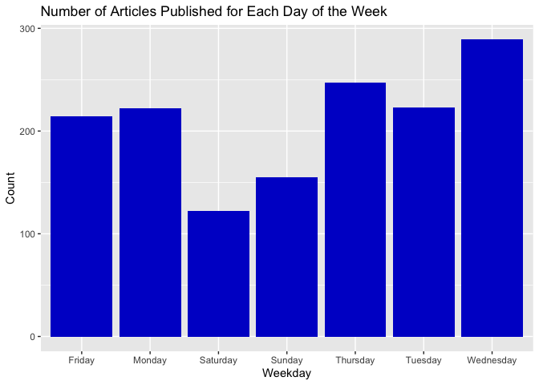
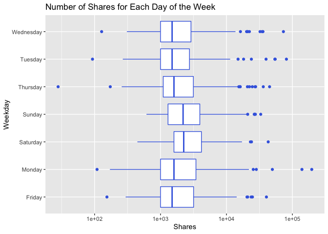

Lifestyle Analysis
================
Rachel Hencher and Yi Ren
2022-11-02

- <a href="#load-packages" id="toc-load-packages">Load packages</a>
- <a href="#data" id="toc-data">Data</a>
  - <a href="#read-in-and-subset-data" id="toc-read-in-and-subset-data">Read
    in and subset data</a>
  - <a href="#choose-an-option-for-the-channel-function-argument"
    id="toc-choose-an-option-for-the-channel-function-argument">Choose an
    option for the <code>channel</code> function argument:</a>
  - <a href="#automation" id="toc-automation">Automation</a>
  - <a href="#split-data-into-train-and-test"
    id="toc-split-data-into-train-and-test">Split data into train and
    test</a>
- <a href="#summarization" id="toc-summarization">Summarization</a>
  - <a href="#barplot-for-weekday" id="toc-barplot-for-weekday">Barplot for
    weekday</a>
- <a href="#boxplot-of-weekday-vs-shares"
  id="toc-boxplot-of-weekday-vs-shares">Boxplot of weekday vs shares</a>
- <a href="#scatterplot-of-title-length--polarity-vs-shares"
  id="toc-scatterplot-of-title-length--polarity-vs-shares">Scatterplot of
  title length &amp; polarity vs shares</a>
  - <a href="#pairs-plot" id="toc-pairs-plot">Pairs plot</a>
- <a href="#modeling" id="toc-modeling">Modeling</a>
  - <a href="#set-up-cross-validation" id="toc-set-up-cross-validation">Set
    up cross validation</a>
  - <a href="#lasso-model" id="toc-lasso-model">LASSO model</a>
  - <a href="#forward-stepwise-model"
    id="toc-forward-stepwise-model">Forward stepwise model</a>
  - <a href="#random-forest-model" id="toc-random-forest-model">Random
    forest model</a>
  - <a href="#boosted-tree-model" id="toc-boosted-tree-model">Boosted tree
    model</a>
- <a href="#comparison" id="toc-comparison">Comparison</a>
  - <a href="#apply-model-for-prediction"
    id="toc-apply-model-for-prediction">Apply model for prediction</a>
  - <a href="#model-performance" id="toc-model-performance">Model
    performance</a>

# Load packages

``` r
library(readr)
library(dplyr)
library(caret)
library(ggplot2)
```

# Data

## Read in and subset data

``` r
OnlineNewsPopularity <- read_csv("OnlineNewsPopularity.csv") 
OnlineNewsPopularity$url <- NULL

news <- OnlineNewsPopularity %>% 
  select("Number_Title_Words" = "n_tokens_title",
         "Number_Content_Words" = "n_tokens_content",
         "Number_Images" = "num_imgs",
         "Number_Videos" = "num_videos",
         starts_with("weekday_is"),
         starts_with("data_channel_is"),
         "Positive_Word_Rate" = "global_rate_positive_words",
         "Negative_Word_Rate" = "global_rate_negative_words",
         "Title_Polarity" = "title_sentiment_polarity",
         "Shares" = "shares")
  
news$Weekday <- as.factor(ifelse(news$weekday_is_monday == 1, "Monday",
                                 ifelse(news$weekday_is_tuesday == 1, "Tuesday", 
                                        ifelse(news$weekday_is_wednesday == 1, "Wednesday", 
                                               ifelse(news$weekday_is_thursday , "Thursday",
                                                      ifelse(news$weekday_is_friday == 1, "Friday",
                                                             ifelse(news$weekday_is_saturday == 1, "Saturday", "Sunday")))))))

news$Channel <- as.factor(ifelse(news$data_channel_is_lifestyle == 1, "Lifestyle",
                                 ifelse(news$data_channel_is_entertainment == 1, "Entertainment", 
                                        ifelse(news$data_channel_is_bus == 1, "Bus", 
                                               ifelse(news$data_channel_is_socmed , "Socmed",
                                                      ifelse(news$data_channel_is_tech == 1, "Tech", "World"))))))
news_final <- news %>%
  select(-c(starts_with("weekday_is"), starts_with("data_channel_is")))
```

## Choose an option for the `channel` function argument:

- *lifestyle*: Is the desired data channel lifestyle?  
- *entertainment*: Is the desired data channel entertainment?  
- *bus*: Is the desired data channel business?  
- *socmed*: Is the desired data channel social media?
- *tech*: Is the desired data channel technology?  
- *world*: Is the desired data channel world?

## Automation

``` r
news_data <- news_final %>% 
  filter(news_final$Channel == params$channel) %>% select(-Channel)
```

## Split data into train and test

``` r
set.seed(216)
intrain <- createDataPartition(news_data$Shares, p = 0.7, list = FALSE)
training <- news_data[intrain,]
testing <- news_data[-intrain,]
```

# Summarization

## Barplot for weekday

``` r
ggplot(training, aes(x = Weekday)) +
  geom_bar(position="dodge")
```

<!-- --> \## Numeric
summaries

``` r
stat <- training %>% select(Number_Title_Words, Number_Content_Words, Number_Images, Number_Videos, Positive_Word_Rate, Negative_Word_Rate, Title_Polarity, Shares) %>% apply(2, function(x){summary(x[!is.na(x)])}) 
knitr::kable(stat, caption = "Summary Stats for All Variables", digits = 2)
```

|         | Number_Title_Words | Number_Content_Words | Number_Images | Number_Videos | Positive_Word_Rate | Negative_Word_Rate | Title_Polarity |    Shares |
|:--------|-------------------:|---------------------:|--------------:|--------------:|-------------------:|-------------------:|---------------:|----------:|
| Min.    |               3.00 |                 0.00 |          0.00 |          0.00 |               0.00 |               0.00 |          -1.00 |     28.00 |
| 1st Qu. |               8.00 |               298.75 |          1.00 |          0.00 |               0.03 |               0.01 |           0.00 |   1100.00 |
| Median  |              10.00 |               498.00 |          1.00 |          0.00 |               0.04 |               0.02 |           0.00 |   1700.00 |
| Mean    |               9.76 |               622.35 |          4.67 |          0.48 |               0.04 |               0.02 |           0.11 |   3687.17 |
| 3rd Qu. |              11.00 |               793.00 |          8.00 |          0.00 |               0.05 |               0.02 |           0.21 |   3225.00 |
| Max.    |              18.00 |              8474.00 |        111.00 |         50.00 |               0.12 |               0.06 |           1.00 | 196700.00 |

Summary Stats for All Variables

# Boxplot of weekday vs shares

``` r
ggplot(training, aes(x = Weekday, y = Shares)) +
  geom_boxplot(color = "royal blue") +
  scale_y_continuous(trans="log10")
```

<!-- -->

# Scatterplot of title length & polarity vs shares

``` r
ggplot(training, aes(x = Number_Title_Words, y = Shares)) + 
  geom_point(aes(color = Title_Polarity))
```

<!-- -->

## Pairs plot

``` r
training_sub <- training %>% select(Weekday)
GGally::ggpairs(training_sub)
```

<!-- -->

# Modeling

## Set up cross validation

``` r
control <- trainControl(method = "cv", number = 5)
```

## LASSO model

``` r
lasso_model <- train(Shares ~ .,
                   data = training,
                   method ='lasso',
                   preProcess = c("center", "scale"),
                   trControl = control)
predict(lasso_model$finalModel, type = "coef")
```

    ## $s
    ##  [1]  1  2  3  4  5  6  7  8  9 10 11 12 13 14
    ## 
    ## $fraction
    ##  [1] 0.00000000 0.07692308 0.15384615 0.23076923 0.30769231 0.38461538
    ##  [7] 0.46153846 0.53846154 0.61538462 0.69230769 0.76923077 0.84615385
    ## [13] 0.92307692 1.00000000
    ## 
    ## $mode
    ## [1] "step"
    ## 
    ## $coefficients
    ##    Number_Title_Words Number_Content_Words Number_Images Number_Videos
    ## 0             0.00000               0.0000      0.000000        0.0000
    ## 1             0.00000               0.0000      0.000000      138.5328
    ## 2             0.00000             308.2257      0.000000      446.7585
    ## 3             0.00000             490.5038      0.000000      618.3755
    ## 4             0.00000             547.7259      0.000000      674.4402
    ## 5             0.00000             560.1326      0.000000      687.1379
    ## 6             0.00000             564.4714      0.000000      691.4326
    ## 7             0.00000             584.4576      0.000000      711.4725
    ## 8           -63.54108             642.9014      0.000000      769.9609
    ## 9           -76.29415             653.8666      0.000000      782.2253
    ## 10          -76.97130             654.4843      0.000000      782.8756
    ## 11          -92.05088             668.5817      0.000000      796.8285
    ## 12          -95.23637             674.4743     -6.645061      798.9564
    ## 13         -120.22250             715.3273    -58.164322      812.5976
    ##    Positive_Word_Rate Negative_Word_Rate Title_Polarity WeekdayMonday
    ## 0             0.00000            0.00000       0.000000        0.0000
    ## 1             0.00000            0.00000       0.000000        0.0000
    ## 2             0.00000            0.00000       0.000000        0.0000
    ## 3             0.00000            0.00000       0.000000      180.5782
    ## 4             0.00000           59.67134       0.000000      239.6589
    ## 5             0.00000           73.20568       0.000000      255.1374
    ## 6             0.00000           77.11953      -4.488534      260.2012
    ## 7             0.00000           96.07728     -28.125811      288.7892
    ## 8             0.00000          152.44431     -96.006716      372.6313
    ## 9            11.05990          163.42588    -111.665319      389.8758
    ## 10           11.64972          164.00271    -112.471441      391.1050
    ## 11           24.59157          174.97297    -130.067141      429.8247
    ## 12           27.10524          176.73272    -132.882278      437.1123
    ## 13           46.23105          190.11502    -151.339412      556.8847
    ##    WeekdaySaturday WeekdaySunday WeekdayThursday WeekdayTuesday
    ## 0          0.00000       0.00000        0.000000        0.00000
    ## 1          0.00000       0.00000        0.000000        0.00000
    ## 2          0.00000       0.00000        0.000000        0.00000
    ## 3          0.00000       0.00000        0.000000        0.00000
    ## 4          0.00000       0.00000        0.000000        0.00000
    ## 5          0.00000      15.76728        0.000000        0.00000
    ## 6          0.00000      21.25706        0.000000        0.00000
    ## 7         28.99886      51.44346        0.000000        0.00000
    ## 8        112.01359     137.34380        0.000000        0.00000
    ## 9        129.09151     154.62991        0.000000        0.00000
    ## 10       130.23795     155.81450        1.258177        0.00000
    ## 11       164.35894     191.80560       41.174412       39.32642
    ## 12       171.66419     199.54596       48.542938       46.63928
    ## 13       276.41809     313.27092      171.675889      166.54379
    ##    WeekdayWednesday
    ## 0            0.0000
    ## 1            0.0000
    ## 2            0.0000
    ## 3            0.0000
    ## 4            0.0000
    ## 5            0.0000
    ## 6            0.0000
    ## 7            0.0000
    ## 8            0.0000
    ## 9            0.0000
    ## 10           0.0000
    ## 11           0.0000
    ## 12           0.0000
    ## 13         131.9782

``` r
lasso_model$bestTune
```

    ##   fraction
    ## 1      0.1

## Forward stepwise model

``` r
fwdstep_model <- train(Shares ~ .,
                   data = training,
                   method ='glmStepAIC',
                   preProcess = c("center", "scale"),
                   trControl = control,
                   direction = "forward",
                   trace = FALSE)
fwdstep_model
```

    ## Generalized Linear Model with Stepwise Feature Selection 
    ## 
    ## 1472 samples
    ##    8 predictor
    ## 
    ## Pre-processing: centered (13), scaled (13) 
    ## Resampling: Cross-Validated (5 fold) 
    ## Summary of sample sizes: 1177, 1177, 1178, 1178, 1178 
    ## Resampling results:
    ## 
    ##   RMSE      Rsquared     MAE     
    ##   8071.276  0.004286913  3351.775

## Random forest model

``` r
rf_model <- train(Shares ~ ., 
                  data = training, 
                  method = "rf", 
                  preProcess = c("center", "scale"), 
                  trControl = control, 
                  tuneGrid = expand.grid(mtry = (1:ncol(training))/3))
```

    ## Warning in randomForest.default(x, y, mtry = param$mtry, ...): invalid mtry:
    ## reset to within valid range

    ## Warning in randomForest.default(x, y, mtry = param$mtry, ...): invalid mtry:
    ## reset to within valid range

    ## Warning in randomForest.default(x, y, mtry = param$mtry, ...): invalid mtry:
    ## reset to within valid range

    ## Warning in randomForest.default(x, y, mtry = param$mtry, ...): invalid mtry:
    ## reset to within valid range

    ## Warning in randomForest.default(x, y, mtry = param$mtry, ...): invalid mtry:
    ## reset to within valid range

    ## Warning in randomForest.default(x, y, mtry = param$mtry, ...): invalid mtry:
    ## reset to within valid range

    ## Warning in randomForest.default(x, y, mtry = param$mtry, ...): invalid mtry:
    ## reset to within valid range

    ## Warning in randomForest.default(x, y, mtry = param$mtry, ...): invalid mtry:
    ## reset to within valid range

    ## Warning in randomForest.default(x, y, mtry = param$mtry, ...): invalid mtry:
    ## reset to within valid range

    ## Warning in randomForest.default(x, y, mtry = param$mtry, ...): invalid mtry:
    ## reset to within valid range

``` r
rf_model
```

    ## Random Forest 
    ## 
    ## 1472 samples
    ##    8 predictor
    ## 
    ## Pre-processing: centered (13), scaled (13) 
    ## Resampling: Cross-Validated (5 fold) 
    ## Summary of sample sizes: 1177, 1177, 1179, 1177, 1178 
    ## Resampling results across tuning parameters:
    ## 
    ##   mtry       RMSE      Rsquared     MAE     
    ##   0.3333333  7621.314  0.005447926  3307.638
    ##   0.6666667  7625.198  0.002863195  3313.748
    ##   1.0000000  7607.204  0.005780968  3301.258
    ##   1.3333333  7609.420  0.004371294  3310.219
    ##   1.6666667  7725.301  0.008201772  3334.233
    ##   2.0000000  7780.980  0.006370242  3346.929
    ##   2.3333333  7749.572  0.007681882  3336.056
    ##   2.6666667  7853.790  0.007720811  3377.625
    ##   3.0000000  7879.970  0.007117402  3392.686
    ## 
    ## RMSE was used to select the optimal model using the smallest value.
    ## The final value used for the model was mtry = 1.

## Boosted tree model

``` r
gbm_model <- train(Shares ~ .,
                     data = training,
                     method = "gbm",
                     trControl = control,
                     preProcess = c("center", "scale"),
                     verbose = FALSE)
gbm_model
```

    ## Stochastic Gradient Boosting 
    ## 
    ## 1472 samples
    ##    8 predictor
    ## 
    ## Pre-processing: centered (13), scaled (13) 
    ## Resampling: Cross-Validated (5 fold) 
    ## Summary of sample sizes: 1178, 1177, 1178, 1178, 1177 
    ## Resampling results across tuning parameters:
    ## 
    ##   interaction.depth  n.trees  RMSE      Rsquared     MAE     
    ##   1                   50      7330.701  0.002307151  3358.458
    ##   1                  100      7398.831  0.001987359  3381.240
    ##   1                  150      7466.179  0.003565683  3420.829
    ##   2                   50      7373.533  0.005774166  3385.976
    ##   2                  100      7473.697  0.006723050  3441.847
    ##   2                  150      7553.264  0.004314856  3485.081
    ##   3                   50      7409.319  0.006832997  3377.195
    ##   3                  100      7611.208  0.004469131  3521.175
    ##   3                  150      7677.556  0.004936298  3569.095
    ## 
    ## Tuning parameter 'shrinkage' was held constant at a value of 0.1
    ## 
    ## Tuning parameter 'n.minobsinnode' was held constant at a value of 10
    ## RMSE was used to select the optimal model using the smallest value.
    ## The final values used for the model were n.trees = 50, interaction.depth =
    ##  1, shrinkage = 0.1 and n.minobsinnode = 10.

# Comparison

## Apply model for prediction

``` r
lasso_predict <- predict(lasso_model, newdata = testing)
fwdstep_predict <- predict(fwdstep_model, newdata = testing)
rf_predict <- predict(rf_model, newdata = testing)
gbm_predict <- predict(gbm_model, newdata = testing)
```

## Model performance

``` r
Lasso <- postResample(lasso_predict, obs = testing$Shares)
Forward_Stepwise <- postResample(fwdstep_predict, obs = testing$Shares)
Random_Forest <- postResample(rf_predict, obs = testing$Shares)
Boosted_Tree <- postResample(gbm_predict, obs = testing$Shares)

rbind(Lasso, Forward_Stepwise, Random_Forest, Boosted_Tree)
```

    ##                      RMSE    Rsquared      MAE
    ## Lasso            9650.057 0.005337779 3285.077
    ## Forward_Stepwise 9646.664 0.004534141 3246.652
    ## Random_Forest    9641.148 0.004767222 3195.742
    ## Boosted_Tree     9642.883 0.005141491 3174.342
